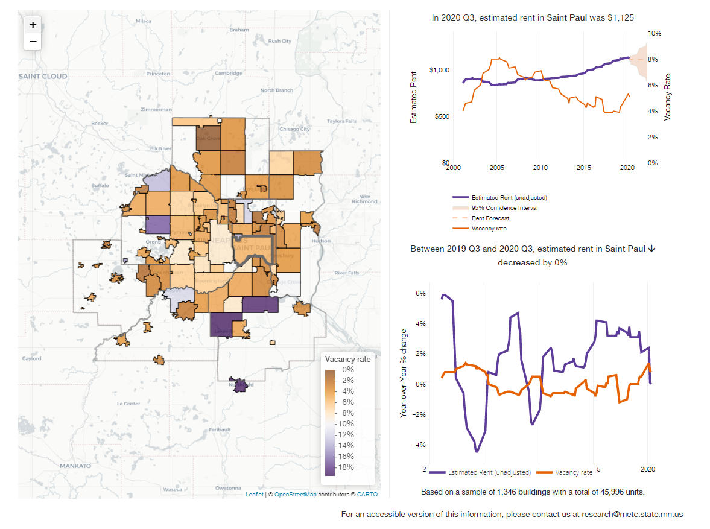
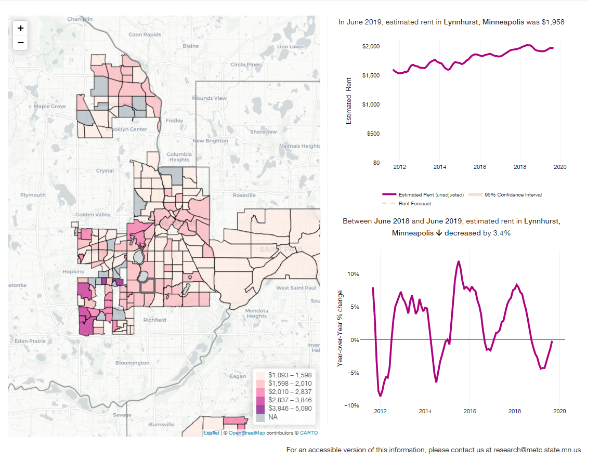

*Twin Cities Rent Trends* is a dashboard for analyzing rental housing market trends in the seven-county Twin Cities region. Rent data can be difficult and costly to obtain, and different sources can yield significantly different values. This app allows users to compare each source and view the data at different geographic levels. Users can view rent trends, including absolute rent price, rents adjusted for inflation, and year-over-year percent change. Users can also visualize the relationship between rent and vacancy rates (not available for all data sources).

I built the app based on the [`{golem}`](https://github.com/ThinkR-open/golem) framework, which builds the app repository as an R package. The result is a robust Shiny app, complete with testing and modular elements. The app integrates other package I've developed, including [`{council.skeleton}`](https://github.com/Metropolitan-Council/council.skeleton) and [`{councilR}`](https://github.com/Metropolitan-Council/councilR). 

## Screenshots  

St. Paul rent and vacancy  
  

Lynnhurst neighborhood rent  
  

Data download page  

